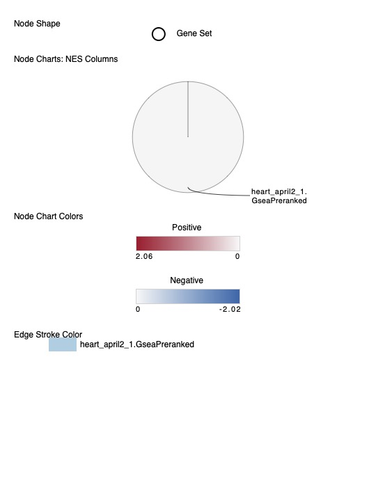
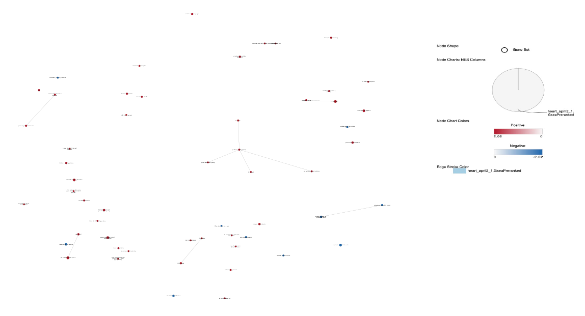
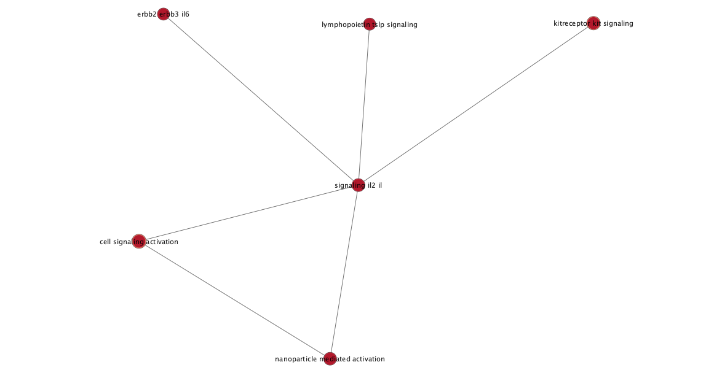

```{r setup, include=FALSE}
knitr::opts_chunk$set(warning = FALSE, message = FALSE)
```

# Introduction

## Data set being analyzed and motivations

Currently, 6.5 million adult Americans are affected by heart failure.  Heart failure has a 5 year mortality rate, despite later-stage heart failure with reduced ejection fraction (HFrEF) showing diverse etiologies and genetic contributions they are still considered to evolve via a final common pathway.  Current therapies are relatively indifferent to disease etiology and treat HFrEF due to ischemic cardiomyopathy (ICM) the same as dilated cardiomyopathy (DCM), even though ICM has a much worse prognosis than DCM.  This can be an indication of an incomplete understanding of the different biological mechanisms contributing to HFrEF [@HeartPaper1].

Throughout the course of the term the data set being studied involved 64 human left ventricular samples, 37 of which are from DCM, 13 from ICM, and 14 from non-failing hearts (NF) were studied.  The study in which the data originated from aimed to uncover common and etiology-specific gene signatures between the three cohorts [@HeartPaper1].

This data set was downloaded from the Gene Expression Omnibus (GEO) and has a GEO accession of [GSE116250](https://www.ncbi.nlm.nih.gov/geo/query/acc.cgi?acc=GSE116250).

## Normalization and initial data exploration

In Assignment 1, the data set has been normalized using RPKM and genes with mean RPKM across all samples less than five have been filtered out to remove some noise.  The decision to use RPMK as the normalization method was that of the authors since the data set posted to GEO was in RPKM.  Prior to removing lowly expressed genes with mean RPKM less than 5 there were 57974 genes.  After removing these lowly expressed genes 12381 genes remained.

It's important note the normalization and data processing methods were not clearly described by the authors in their original paper. In Assignment 1, I performed TMM normalization to see if the authors performed any normalization between samples.  The hypothesis was if the data has been normalized between samples as well then the plots before TMM normalization and after TMM normalization should be the same.  In the density plot post TMM normalization there was a large spike at 0 essentially making all the data at one point.  This density plot does not make sense.  Furthermore, this is a drastic change to the original data and is undesired. 

Due to the results seen from the plots after TMM normalization and lack of information in the paper about normalization methods used other than RPKM, it was concluded the data posted is already normalized.  Further normalization of this data results in dramatic changes to the data that isn't desirable.

Density plots of DCM, ICM, and NF with just RPKM normalization can be found in the appendix.

## Differential gene expression and preliminary over-representation analysis

In Assignment 2, the normalized expression data was ranked based on their differential expression and a threshold over-representation analysis (ORA) was performed highlighting the dominant themes in the gene list.  It was found the dominant themes were mitochondria, metabolic processes, and gene expression such as in transcription and translation.

This is consistent with the findings of [@HeartPaper1].  Additionally, a study by [@NaturePaper] detailed ten genes that have most commonly been implicated in DCM are mostly involved in gene expression such as in the transcription and translation process.  A study looking at candidate genes in ICM had similar results where they found that enriched pathways in ICM were associated with mitochondria and gene expression such as in post-translational modification [@ICMPaper].

In this final assignment a non-thresholded gene set enrichment analysis (GSEA) will be conducted followed by a visualization of the results in Cytoscape with the use of the EnrichmentMap pipeline.  Finally, a post analysis will be conducted examining potential drugs being used in the treatment of these diseases.

```{r}
# Install required packages 
if (!requireNamespace("BiocManager", quietly = TRUE)) {
  install.packages("BiocManager")
}
if (!requireNamespace("tibble", quietly = TRUE)) {
  install.packages("tibble")
}
if (!requireNamespace("dplyr", quietly = TRUE)) {
  install.packages("dplyr")
} 
if (!requireNamespace("tidyr", quietly = TRUE)) {
  install.packages("tidyr")
}
if (!requireNamespace("readr", quietly = TRUE)) {
  install.packages("readr")
}
if (!requireNamespace("fgsea", quietly = TRUE)) {
  BiocManager::install("fgsea")
}

suppressPackageStartupMessages({
  library("tibble")
  library("dplyr")
  library("fgsea")
})
```

First, let's get the list of genes that were calculated to be differentially expressed in Assignment 2 and get their ranks to make a ranked gene list.

```{r}
# load in the ranked gene list 
rankFile <- "ranked_genes.rds"
if (file.exists(rankFile)) {
  rankedGenes <- readRDS(rankFile)
  
  # filter to only the gene name and rank
  rankedGenes <- rankedGenes[, c("hgnc_symbol", "rank")]

} else {
  # if the ranked gene list doesn't exist yet, load in the output hits data from assignment 2
  outputHitsFileName <- "output_hits.rds"
  outputHits <- readRDS(outputHitsFileName)
  
  outputHits <- tibble::as_tibble(outputHits)
  
  # calculate the rank
  outputHits$rank <- -log(outputHits$P.Value, base = 10) * sign(outputHits$logFC) 
  
  # save for future use
  saveRDS(outputHits, rankFile)
  
  # only keep gene symbol and rank column
  rankedGenes <- dplyr::select(outputHits, hgnc_symbol, rank)
}
```

# Non-thresholded Gene set Enrichment Analysis

Next, let's conduct a non-thresholded gene set enrichment analysis.

```{r, warning=FALSE}
# load in the gene set to use from Bader labs
pathways <- fgsea::gmtPathways("Human_GOBP_AllPathways_no_GO_iea_March_02_2023_symbol.gmt")

# conduct gsea
gseaResults <- fgsea::fgsea(pathways = pathways, 
                            stats = tibble::deframe(rankedGenes), 
                            maxSize = 200, 
                            minSize = 15, 
                            nperm = 1000)

gseaResults <- tibble::as_tibble(gseaResults) 
```

Let's examine the top few gene sets overrepresented at the top of the ranked list.

```{r}
# order results in descending value of NES (enrichment score normalized to mean enrichment of random samples of the same size)
gseaResultsTop <- gseaResults %>% dplyr::arrange(desc(NES))

# view the results associated with the top of the list with largest NES
head(gseaResultsTop)
```

Table 1: Results from GSEA of top 6 gene sets overrepresented at the top of the ranked list.

Next, let's look at the results of the top 6 gene sets overrepresented at the bottom of the ranked list.

```{r}
# view the results associated with the bottom of the list with lowest NES
gseaResultsBottom <- gseaResults %>% dplyr::arrange(NES)

head(gseaResultsBottom)
```

Table 2: Results from GSEA of top 6 gene sets overrepresented at the bottom of the ranked list.

**1. What method did you use? What genesets did you use? Make sure to specify versions and cite your methods.**

I decided to use the function `fgsea` from the R package `fgsea` for the gene set enrichment analysis.  It uses a fast algorithm for the GSEA allowing more permutations in a shorter amount of computation time [@fgsea]. It allows for the GSEA to be computed on the fly in a short amount of time and when compared to the GSEA Java app it gives similar results.

The gene sets I used were from the Bader Lab dated March 2, 2023.  They include all human pathways from GO Biological Process and they do not have inferred electronic annotations [@BaderLab]. No electronic annotations were chosen to reduce noise and ensure higher accuracy of the results. 

**2. Summarize your enrichment results.**

From the GSEA the gene sets associated with the genes overrepresented at the top of the ranked list are more correlated with mitochondrial gene expression such as translation initiation and translation termination, seen in Table 1.  In Table 2, it shows that the genes sets associated with the genes overrepresented at the bottom of the ranked list are more correlated with metabolic processes like glycosaminoglycan metabolism and proteoglycan metabolism.  

This indicates that those with DCM and ICM experience mitochondrial dysfunction.  This is consistent with what the authors have found in their paper [@HeartPaper1].  It also shows that there are common pathways of mitochondrial dysfunction in DCM and ICM.  For the gene sets enriched at the bottom of the ranked list it indicates there is enrichment in metabolic processes with the top one being glycosaminoglycan metabolism.  Glycosaminoglycans are key players in organizing the extra cellular matrix, cell-matrix interactions and signal regulations [@Glycosaminoglycan].  Literature shows that the extracellular matrix is crucial in cardiac homeostasis as it provides structural support and facilitates key signals to cardiomyocytes, vascular cells, and interstitial cells.  Changes in such can potentially cause heart failure [@extracellularMatrix].  Thus gene sets more correlated with bottom of the ranked list are related to the extracellular matrix and cell-cell interactions. 

**3. How do these results compare to the results from the thresholded analysis in Assignment #2. Compare qualitatively. Is this a straight forward comparison? Why or why not?**

The results for the up regulated genes in Assignment 2 were:

```{r}
upFilePath <- "thresholded_gsea_up.rds"
a2UpResults <- readRDS(upFilePath)

head(a2UpResults)
```

Table 3: Enriched gene sets from thresholded GSEA (threshold: 0.05) using up regulated genes only.

The results for the down regulated genes in Assignment 2 were: 

```{r}
downFilePath <- "thresholded_gsea_down.rds"
a2DownResults <-  readRDS(downFilePath)

head(a2DownResults)
```

Table 4: Enriched gene sets from thresholded GSEA (threshold: 0.05) using down regulated genes only.

The threshold for both up and down regulated genes was 0.05 and FDR was used for multiple hypothesis testing correction.

Based on the results from Assignment 2 the main themes for the up regulated genes is relatively consistent. The top two results in Table 3, thresholded GSEA, are mitochondrial gene expression and in Table 1, non-thresholded GSEA, all the results except the second are for mitochondrial translation. However, there are some differences in that the thresholded analysis results seem more general in that it mainly highlights gene expression while the non-thresholded analysis results seem a bit more specific.  Non-thresholded results seem more specific since it highlights they are mainly localized in the mitochondria and it indicates which parts of translation it relates to.  In the thresholded results there are results for non-mitochondrial translation such as cytoplasmic translation which is less specific.  

For the down-regulated genes there is more variation in the results.  In Table 2, the non-thresholded analysis mainly shows themes in metabolism such as glycosaminoglycan, proteoglycan, and amine metabolism.  Whereas in Table 4, the thresholded analysis, shows dominant themes in cell organization and cell structure such as lysosome organization.

Although the results aren't exactly the same I don't believe they are necessarily in disagreement.  They both align with similar more general themes.  For example, the up regulated genes in both analysis can be said to be involved in translation while the down regulated genes can be involved in metabolism of molecules needed for cell structure and organization.

These results still align with the experiment conditions, namely the samples and disease being studied.  Dysregulation in translation and cell structure and organization can be implicated in heart disease [@HeartPaper1].  I don't think this is a straight forward comparison, because different gene sets were used in these two analyses.  It's possible that some of the pathways are different because they weren't included in the other ananlysis's gene set.

# Visualize Gene set Enrichment Analysis in Cytoscape

**1. Create an enrichment map - how many nodes and how many edges in the resulting map? What thresholds were used to create this map? Make sure to record all thresholds. Include a screenshot of your network prior to manual layout.**

There are 136 nodes and 230 edges in the resulting map.  An FDR q-value of 1.0 was used and a p-value of 0.01.


**2. Annotate your network - what parameters did you use to annotate the network. If you are using the default parameters make sure to list them as well.**

The AutoAnnotate app that came with the EnrichmentMap pipeline was used to annotate the network.  The parameters used were the MCL Cluster algorithm and annotate with a maximum of 50 annotations to allow for a more readable network.  The label column was GS_DESCR.  The option to layout the network to prevent cluster overlap was also chosen to increase readability.

**3. Make a publication ready figure - include this figure with proper legends in your notebook.**

Below in Figure 2 is the publication ready figure.




**4. Collapse your network to a theme network. What are the major themes present in this analysis? Do they fit with the model? Are there any novel pathways or themes?**

Below in Figure 4 is the collapsed theme network generated from using "Collapse All" in AutoAnnotate.



Major themes seen include arrhythmia of the heart (Figure 5), mitochondrial translation (Figure 6), cell signalling and immune pathways (Figure 7).


Considering this study looked at samples with heart disease (DCM, ICM, and NF) it is not surprising to find themes regarding arrhythmias of the heart.  Having these heart diseases can cause irregular heart rhythms.  




Figure 7 shows cell signalling and immune system as major themes.  In particular il2 is Interleukin 2, a cytokine signalling molecule in the immune system. 

These major themes make sense for the disease being studied.  Cardiomyopathy can cause arrhythmias since the heart has difficulty pumping blood through the body. DCM has been shown to be enriched in pathways for cell-cell and cell-matrix interactions.  ICM has been shown to have cytoskeletal and immune pathways enriched.  Both ICM and DCM have also been shown to share mitochondrial dysregulation as common pathways too [@HeartPaper1].

# Interpretation and detailed view of results

**1. Do the enrichment results support conclusions or mechanism discussed in the original paper? How do these results differ from the results you got from Assignment #2 thresholded methods**

Yes, the enrichment results support the conclusions and mechanisms discussed in the original paper.  The authors found that in DCM and ICM there were pathways enriched for mitochondria and dysregulation in these pathways contribute to mitochondrial dysfunction [@HeartPaper1].  The authors also found some pathways enriched in metabolism such as oxidative phosphorylation and some of the results here in the non-thresholded analysis particularly with the down regulated genes saw the same enrichment in metabolic pathways.  The exact metabolic pathways are different but still show the theme of metabolism.

The results here differ from the thresholded results in Assignment 2 in that the more specific themes are different.  In the up regulated genes in Assignment 2 there were themes of gene expression, mainly translation, in mitochondria and elsewhere.  While here in the non-thresholded analysis it shows themes of gene expression, mainly translation as well, but only in the mitochondria.  They also both include a pathway for cellular redox reactions with the non-thresholded analysis being more specific in specifying hallmark reactive oxygen species pathway.

In the down-regulated genes the results are more variable.  In the thresholded analysis of Assignment 2 they were mainly related to cell structure and organization such as lysosome organization and GPI anchor biosynthetic process.  On the other hand, in the non-thresholded analysis they were mainly about metabolic processes for specific molecules like glycosaminoglycan metabolism and proteoglycan metabolism.  

**2. Can you find evidence, i.e. publications, to support some of the results that you see. How does this evidence support your result?**

Yes, there is evidence from other publications to support some of the results that are seen.  In a previous studies identifying candidate genes in ICM they found that some of the top significantly enriched pathways were related to gene expression such as post-translational modification and were involved in the mitochondria.  The authors of that study also used the data set studied here to validate their results for some of the differentially expressed genes and found the results in this study were consistent with their findings [@ICMPaper].  Publications also indicate DCM and other cardiomyopathies are associated with mitochondrial disorders, supporting the results seen here [@NaturePaper].

The results here for the non-thresholded analysis show the top enriched gene set for the negatively ranked genes is diseases associated with glycosaminoglycan.  Glycosaminoglycan takes part in organizing the cellular matrix, cell-matrix interactions, and signal regulations [@Glycosaminoglycan].  It has been shown that changes to the extracellular matrix can be implicated in the pathogenesis of heart failure [@extracellularMatrix].  The authors of the original paper saw enrichment in pathways for cell-cell and cell-matrix pathways also [@HeartPaper1].

This evidence supports the result found here that gene expression especially in mitochondria and metabolism are major themes in the cardiomyopathies studied here.  

# Post analysis

For the post analysis,  I chose to add drugs to my network. The drugs added were verapamil, lidocaine,  mexiletine, sacubitril, valsartan, digoxin, atenolol, nebivolol, and sotalol.  I chose these drugs because they are common drugs prescribed to those with ICM and DCM [@DCMICMDrugs].  These drugs are also common in treating heart failure in general [@DCMDrugs].  In particular, I was interested in seeing verapamil since it's used to treat arrhythmia, a common symptom of ICM and DCM [@Verapamil]. Similarly, soltalol is used to treat arrhythmia and it was related to the "sotalol action antiarrhythmic" node in the collapsed network seen in Figure 5 [@Soltalol].


Of the 9 drugs added there were 2 were found to be statistically significant with a threshold of 0.05 using the one sided Mann-Whitney test.  They were verapamil and soltalol.  

Since there are a few drugs and only 2 were significant at this threshold I decided to make the cutoff more permissive, 1, to include all the drugs.  In this network the orange edges represent the interactions a drug has with the pathways in the network.  

In this network only Lidocaine was shown to have edges between any of the pathways despite other drugs like verapamil and soltalol having a lower score meaning they're more statistically significant.  Lidocaine is similar to verapamil and soltalol in that one of its uses is for treating arrhythmias [@Lidocaine].

Verapamil, soltalol, and Lidocaine are all drugs that are used to treat arrhythmia and that is one of the symptoms of cardiomyopathies and heart failure.  Thus it is reasonable to see some significance and interactions for these drugs in this network.

Lidocaine interacts with a pathway involving ErbB1 which is an epidermal growth factor receptor. Regarding epidermal growth factors, this is slightly a more novel pathway that's uncovered.  In previous analyses and the original paper it mentions the main pathways in DCM and ICM are involved in mitochondria dysfunction, cell-cell interactions and immune response [@HeartPaper1].  However, this is still consistent with the samples/disease being studied.  DCM and ICM are subtypes of cardiomyopathy which is a heart disease making it harder for the heart to pump blood to the rest of the body.  A potential reason that can explain why it is more difficult for those with DCM and ICM to pump blood to the rest of the body could be related to dysregulation in epidermal growth factors.  This dysregulation could affect the composition of the heart and as a result its function as a muscle so it makes sense why this drug could be potentially targeting this epidermal growth factor.

# Conclusion

Overall, the results in these three assignments support the findings of the authors and other studies that mitochondrial dysfunction is a common pathway between DCM and ICM. There is also evidence for enrichment in metabolism of molecules important to the extracellular matrix, cell-cell interactions, and cell-matrix interactions.  Disruption to these pathways can cause heart failure.  The drugs prescribed to those with DCM and ICM are also seen to interact with the enriched pathways, such as lidocaine.

The authors of the original paper did a comparison between each pair of cohorts as well to seek more fine differences between each cohort.  This includes DCM vs ICM, DCM vs NF, and ICM vs NF.  It would be interesting to do the analysis between each pair of cohorts and compare the results to the authors' results, however that would be quite time consuming.  It is still interesting to see the larger themes found in these analyses match those of the authors and that they align with the context of the disease being studied.  

# Journal entry link

The link to the corresponding journal entry can be found [here](https://github.com/bcb420-2023/Angela_Ng/wiki/Assignment-%233:-Data-set-Pathway-and-Network-Analysis).

# Appendix

Note these plot the density vs mean RPKM.  RPKM less than 5 in genes across all samples have been filtered out so its possible that genes with mean less than 5 exist in one cohort but their overall mean RPKM across all samples is greater than or equal to five.  Hence, it's possible to have the small bump before 5.


# References